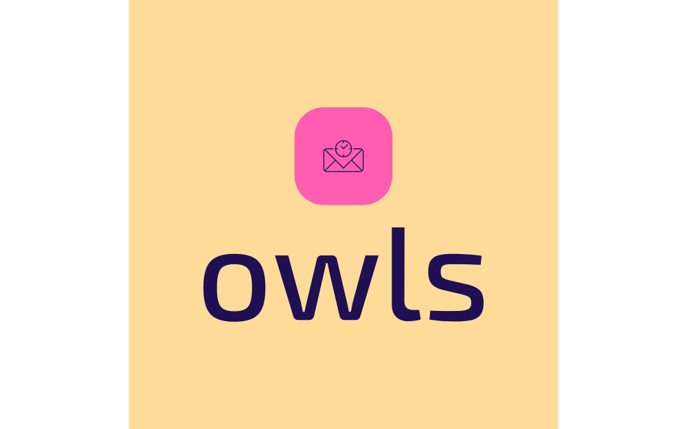

[![Contributors][contributors-shield]][contributors-url]
[![Forks][forks-shield]][forks-url]
[![Stargazers][stars-shield]][stars-url]
[![Issues][issues-shield]][issues-url]
[![GNUv3 License][license-shield]][license-url]


<!-- PROJECT LOGO -->
<br />
<div align="center">
  <a href="https://github.com/isaacwuerth/owls">
    
  </a>

<h3 align="center">owls</h3>

  <p align="center">
    Administration for clubs for information access and scheduling.
    <br />
    <!--
    <a href="https://github.com/othneildrew/Best-README-Template"><strong>Explore the docs »</strong></a>
    <br />
    <br />
    <a href="https://github.com/othneildrew/Best-README-Template">View Demo</a>
    ·
    -->
    <a href="https://github.com/isaacwuerth/owls/issues">Report Bug</a>
    ·
    <a href="https://github.com/isaacwuerth/owls/issues">Request Feature</a>
  </p>
</div>


<!-- TABLE OF CONTENTS -->
<details>
  <summary>Table of Contents</summary>
  <ol>
    <li>
      <a href="#about-the-project">About The Project</a>
      <ul>
        <li><a href="#built-with">Built With</a></li>
      </ul>
    </li>
    <li>
      <a href="#getting-started">Getting Started</a>
      <ul>
        <li><a href="#prerequisites">Prerequisites</a></li>
        <li><a href="#installation">Installation</a></li>
      </ul>
    </li>
    <li><a href="#usage">Usage</a></li>
    <li><a href="#roadmap">Roadmap</a></li>
    <li><a href="#contributing">Contributing</a></li>
    <li><a href="#license">License</a></li>
    <li><a href="#contact">Contact</a></li>
    <li><a href="#acknowledgments">Acknowledgments</a></li>
  </ol>
</details>


<!-- ABOUT THE PROJECT -->
## About The Project

TODO Create a description of the project.


### Built With

This project was build with:

* [![React][React.js]][React-url]
* [![recoil][recoiljs.org]][recoil-url]
* [![Material UI][mui.com]][mui-url]

<p align="right">(<a href="#readme-top">back to top</a>)</p>


<!-- GETTING STARTED -->
## Getting Started

This section explains on how to setup this project on your own.

### Prerequisites

* npm
  ```sh
  npm install npm@latest -g
  ```

### Installation

1. Clone the repo
   ```sh
   git clone https://github.com/isaacwuerth/owls
   ```
2. Create a `.env` file in the root directory and add the following or copy the `.env.example` file.
   ```dotenv
    REACT_APP_VERSION=
    REACT_APP_NAME=
    REACT_APP_FIREBASE_API_KEY=
    REACT_APP_FIREBASE_AUTH_DOMAIN=
    REACT_APP_FIREBASE_DATABASE_URL=
    REACT_APP_FIREBASE_PROJECT_ID=
    REACT_APP_FIREBASE_STORAGE_BUCKET=
    REACT_APP_FIREBASE_MESSAGING_SENDER_ID=
    REACT_APP_FIREBASE_APP_ID=
    REACT_APP_FIREBASE_MEASUREMENT_ID=
    REACT_APP_SENTRY_DSN=
    REACT_APP_SENTRY_AUTH_TOKEN=
    REACT_APP_SENTRY_ORG=
    REACT_APP_SENTRY_PROJECT=
    REACT_APP_SENTRY_RELEASE_VERSION=
    REACT_APP_SENTRY_ENVIRONMENT=
    REACT_APP_OPENREPLAY_PROJECTKEY=
   ```
3. Install NPM packages
   ```sh
   npm install
   ```
4. Build it
   ```sh
   npm run build
   ```
5. Run it
   ```sh
   npm start
   ```


<p align="right">(<a href="#readme-top">back to top</a>)</p>


<!-- USAGE EXAMPLES -->
## Usage

This project was created for a field hockey club for better planning and information distribution.


<!--_For more examples, please refer to the [Documentation](https://example.com)_-->

<p align="right">(<a href="#readme-top">back to top</a>)</p>


<!-- ROADMAP -->
## Roadmap

- [ ] File manager
- [ ] Calendar
- [ ] User management
- [ ] User roles
- [ ] User permissions

- See the [open issues](https://github.com/isaacwuerth/owls//issues) for a full list of proposed features (and known issues).

<p align="right">(<a href="#readme-top">back to top</a>)</p>


<!-- CONTRIBUTING -->
## Contributing

Contributions are what make the open source community such an amazing place to learn, inspire, and create. Any contributions you make are **greatly appreciated**.

Please follow the [Contribution Guidelines](.\CONTRIBUTING.md) when contributing to this project.

<p align="right">(<a href="#readme-top">back to top</a>)</p>


<!-- LICENSE -->
## License

Distributed under the MIT License. See [`LICENSE`](LICENSE) for more information.

<p align="right">(<a href="#readme-top">back to top</a>)</p>


<!-- CONTACT -->
## Contact

Isaac Würth - [@isaacwuerth](https://twitter.com/isaacwuerth) - isaac.wuerth[at]outlook.com

Project Link: [https://github.com/isaacwuerth/owls](https://github.com/isaacwuerth/owls)

<p align="right">(<a href="#readme-top">back to top</a>)</p>


<!-- ACKNOWLEDGMENTS -->
## Acknowledgments

## Some helpful links used to create this project
I've included a few of my favorites to kick things off!

* [Choose an Open Source License](https://choosealicense.com)
* [GitHub Emoji Cheat Sheet](https://www.webpagefx.com/tools/emoji-cheat-sheet)
* [Malven's Flexbox Cheatsheet](https://flexbox.malven.co/)
* [Malven's Grid Cheatsheet](https://grid.malven.co/)
* [Img Shields](https://shields.io)
* [GitHub Pages](https://pages.github.com)
* [Font Awesome](https://fontawesome.com)
* [React Icons](https://react-icons.github.io/react-icons/search)
* [Best README Template](https://github.com/othneildrew/Best-README-Template)

<p align="right">(<a href="#readme-top">back to top</a>)</p>


<!-- MARKDOWN LINKS & IMAGES -->
<!-- https://www.markdownguide.org/basic-syntax/#reference-style-links -->
[contributors-shield]: https://img.shields.io/github/contributors/isaacwuerth/owls.svg?style=for-the-badge
[contributors-url]: https://github.com/isaacwuerth/owls/graphs/contributors
[forks-shield]: https://img.shields.io/github/forks/isaacwuerth/owls.svg?style=for-the-badge
[forks-url]: https://github.com/isaacwuerth/owls/network/members
[stars-shield]: https://img.shields.io/github/stars/isaacwuerth/owls.svg?style=for-the-badge
[stars-url]: https://github.com/isaacwuerth/owls/stargazers
[issues-shield]: https://img.shields.io/github/issues/isaacwuerth/owls.svg?style=for-the-badge
[issues-url]: https://github.com/isaacwuerth/owls/issues
[license-shield]: https://img.shields.io/github/license/isaacwuerth/owls.svg?style=for-the-badge
[license-url]: https://github.com/isaacwuerth/owls/blob/master/LICENSE
[linkedin-shield]: https://img.shields.io/badge/-LinkedIn-black.svg?style=for-the-badge&logo=linkedin&colorB=555
[linkedin-url]: https://linkedin.com/in/othneildrew
[product-screenshot]: images/screenshot.png
[Next.js]: https://img.shields.io/badge/next.js-000000?style=for-the-badge&logo=nextdotjs&logoColor=white
[Next-url]: https://nextjs.org/
[React.js]: https://img.shields.io/badge/React-20232A?style=for-the-badge&logo=react&logoColor=61DAFB
[React-url]: https://reactjs.org/
[Vue.js]: https://img.shields.io/badge/Vue.js-35495E?style=for-the-badge&logo=vuedotjs&logoColor=4FC08D
[Vue-url]: https://vuejs.org/
[Angular.io]: https://img.shields.io/badge/Angular-DD0031?style=for-the-badge&logo=angular&logoColor=white
[Angular-url]: https://angular.io/
[Svelte.dev]: https://img.shields.io/badge/Svelte-4A4A55?style=for-the-badge&logo=svelte&logoColor=FF3E00
[Svelte-url]: https://svelte.dev/
[Laravel.com]: https://img.shields.io/badge/Laravel-FF2D20?style=for-the-badge&logo=laravel&logoColor=white
[Laravel-url]: https://laravel.com
[Bootstrap.com]: https://img.shields.io/badge/Bootstrap-563D7C?style=for-the-badge&logo=bootstrap&logoColor=white
[Bootstrap-url]: https://getbootstrap.com
[JQuery.com]: https://img.shields.io/badge/jQuery-0769AD?style=for-the-badge&logo=jquery&logoColor=white
[JQuery-url]: https://jquery.com
[recoiljs.org]: https://img.shields.io/badge/Recoil-4A4A55?style=for-the-badge&logo=recoiljs&logoColor=FF3E00
[recoil-url]: https://recoiljs.org/
[mui.com]: https://img.shields.io/badge/Material--UI-0081CB?style=for-the-badge&logo=material-ui&logoColor=white
[mui-url]: https://mui.com/
